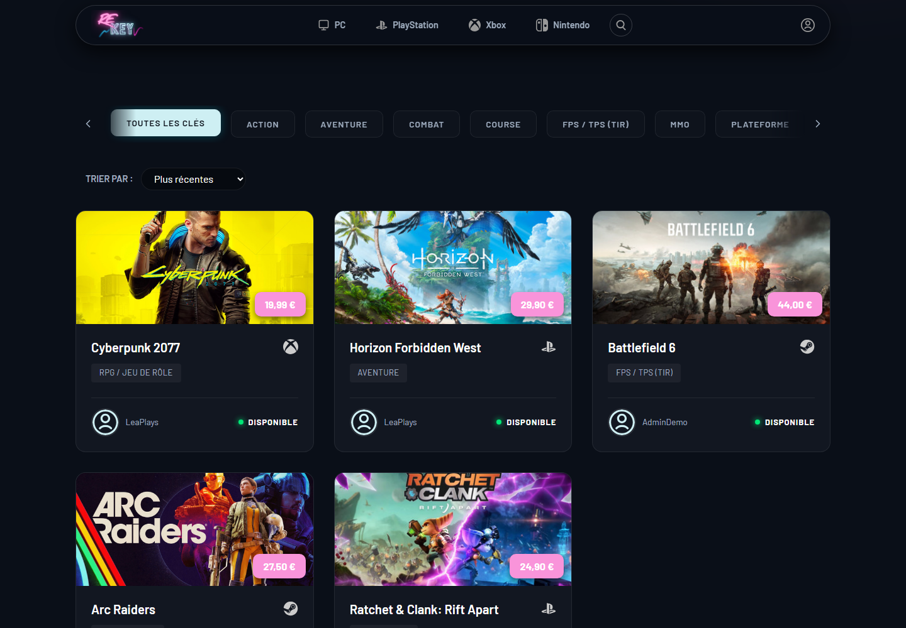
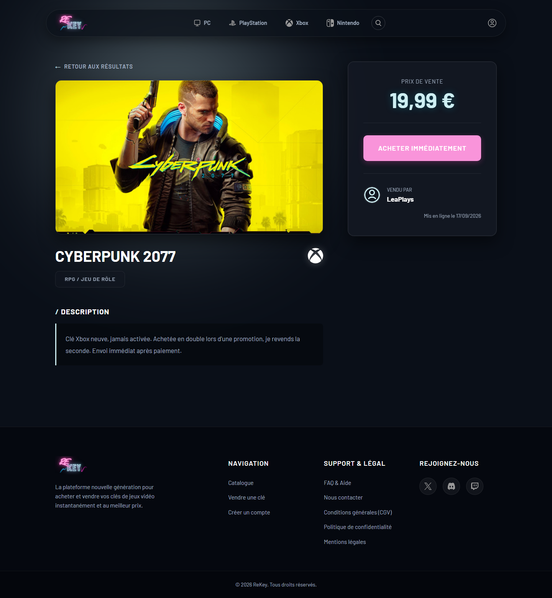
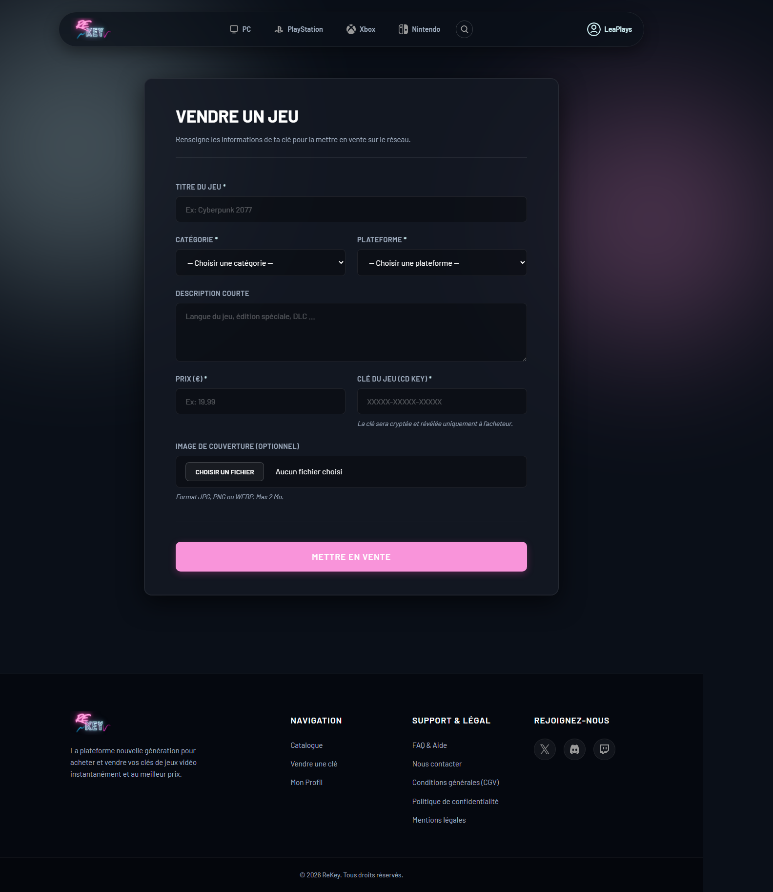
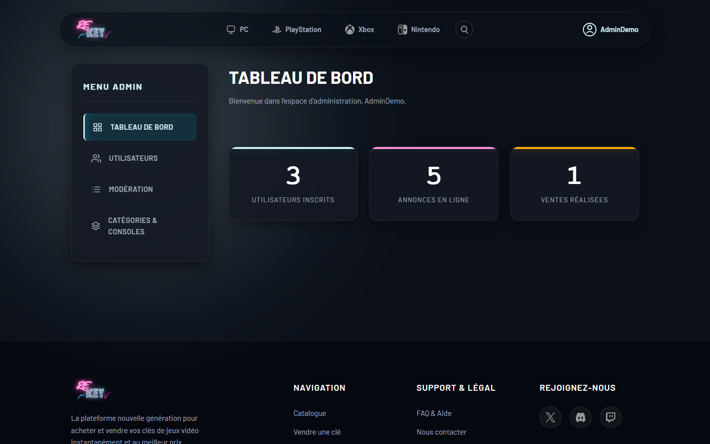

<p align="center">
  
</p>

<h1 align="center">ReKey</h1>

<p align="center">
  Place de marché entre particuliers pour l'achat et la revente de clés de jeux vidéo dématérialisées.<br>
  <em>Projet fil rouge du Titre Professionnel Développeur Web et Web Mobile — réalisé seul en 6 semaines.</em>
</p>

---

## Le projet en deux mots

ReKey est une application web complète de type petites annonces : les utilisateurs créent un compte, déposent leurs clés de jeux à la revente, parcourent le catalogue par plateforme et par catégorie, et passent commande. Un back-office permet d'administrer les annonces, les utilisateurs et les catégories.

Le projet a été développé **sans framework**, sur une architecture en couches écrite intégralement à la main — le but étant de comprendre les mécanismes qu'un Symfony ou un Laravel automatise avant de les utiliser : routage, autoload, injection de dépendances, séparation des responsabilités.

**~5 900 lignes de PHP · 21 vues · 8 tables · tests unitaires PHPUnit**

## Aperçu

**Catalogue** — filtres par catégorie, tri, statut de chaque annonce



**Fiche annonce**



<table>
  <tr>
    <td width="50%"><strong>Dépôt d'une annonce</strong><br></td>
    <td width="50%"><strong>Back-office</strong><br></td>
  </tr>
</table>

<sub>Captures réalisées en local avec un jeu de données de démonstration.</sub>

## Fonctionnalités

**Côté visiteur**
- Catalogue d'annonces avec recherche et filtres par catégorie et par plateforme (Steam, Epic, GOG, PlayStation, Xbox, Nintendo)
- Fiche détaillée d'une annonce
- Inscription et connexion

**Côté membre**
- Gestion du profil et édition des informations personnelles
- Dépôt d'une annonce avec upload d'image, modification et suppression
- Suivi de ses propres annonces et de ses achats
- Tunnel de commande
- Favoris et avis

**Côté administrateur**
- Tableau de bord
- Modération des annonces
- Gestion des utilisateurs et des catégories

## Architecture

Application organisée en couches, avec un point d'entrée unique et un code applicatif placé hors du dossier exposé au web.

```
public/          <- seul dossier exposé : front controller + assets
  index.php      <- routeur, initialisation CSRF, injection des dépendances
src/
  Controller/    <- 9 contrôleurs : reçoivent la requête, appellent les services
  Service/       <- 7 services : logique métier et validation
  Repository/    <- 5 repositories : accès aux données, requêtes préparées
  Entity/        <- 5 entités : User, Ad, Category, Platform, Order
template/        <- vues PHP et partials
tests/           <- tests unitaires PHPUnit
conception/      <- schéma de la base de données
```

**Le flux d'une requête :** `index.php` analyse l'URL, en déduit le contrôleur et la méthode, instancie les repositories puis les services, les injecte dans le contrôleur et l'exécute. Une URL inconnue est renvoyée vers `E404Controller`.

**Pourquoi cette séparation ?** Le contrôleur ne sait pas comment les données sont stockées, le service ne sait pas qu'il existe une requête HTTP, et le repository ne contient aucune règle métier. C'est ce découplage qui rend la couche métier testable sans base de données — voir la section Tests.

## Sécurité

- **CSRF** : un token généré avec `random_bytes(32)` est placé en session à l'ouverture et vérifié sur les formulaires
- **Mots de passe** : hashés, jamais stockés en clair
- **Injections SQL** : requêtes préparées via PDO sur l'ensemble des accès aux données
- **Validation côté serveur** : les données entrantes sont contrôlées dans la couche service, indépendamment des validations HTML
- **Secrets** : identifiants de base de données dans un fichier `.env` exclu du dépôt
- **Exposition minimale** : seul `public/` est accessible depuis le web, le reste du code est hors du document root

## Tests

Tests unitaires avec **PHPUnit**, écrits avec des mocks des repositories pour tester la logique métier isolément, sans toucher à la base de données.

```bash
composer install
vendor/bin/phpunit
```

Exemple de cas couvert : `AdService` doit lever une exception si un utilisateur soumet une annonce avec un prix négatif — un test qui vérifie que la validation métier ne dépend pas du formulaire HTML.

## Stack

| Domaine | Technologies |
|---|---|
| Back-end | PHP 8 orienté objet, autoload PSR-4 (Composer) |
| Base de données | MySQL, PDO avec requêtes préparées |
| Front-end | HTML5, CSS3 écrit à la main, JavaScript |
| Tests | PHPUnit 9 |

## Installation locale

```bash
git clone https://github.com/DilanH76/rekey.git
cd rekey
composer install
```

Créer la base de données à partir de `conception/base.sql`, puis un fichier `.env` à la racine :

```
DB_HOST=localhost
DB_NAME=rekey
DB_USER=root
DB_PASS=
```

Faire pointer le document root du serveur sur le dossier `public/`.

## Contexte

Projet réalisé dans le cadre du Titre Professionnel Développeur Web et Web Mobile (niveau 5) à La Manu, Le Havre — conception, développement, documentation technique et soutenance devant jury.

Les données sont fictives : le site n'a jamais été mis en ligne et ne traite aucune transaction réelle.

---

**Dilan Houlbrèque** — Développeur web full-stack, Le Havre · [github.com/DilanH76](https://github.com/DilanH76) · dilan.hlbrq@gmail.com
